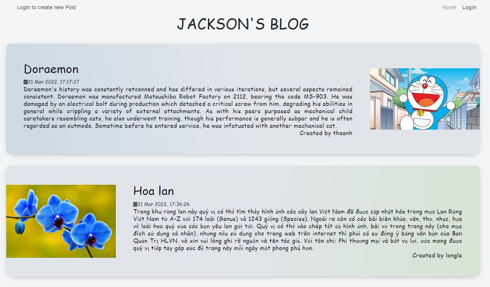
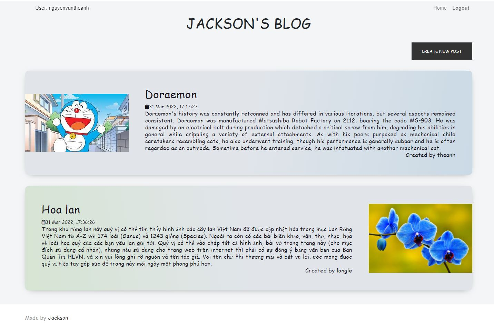
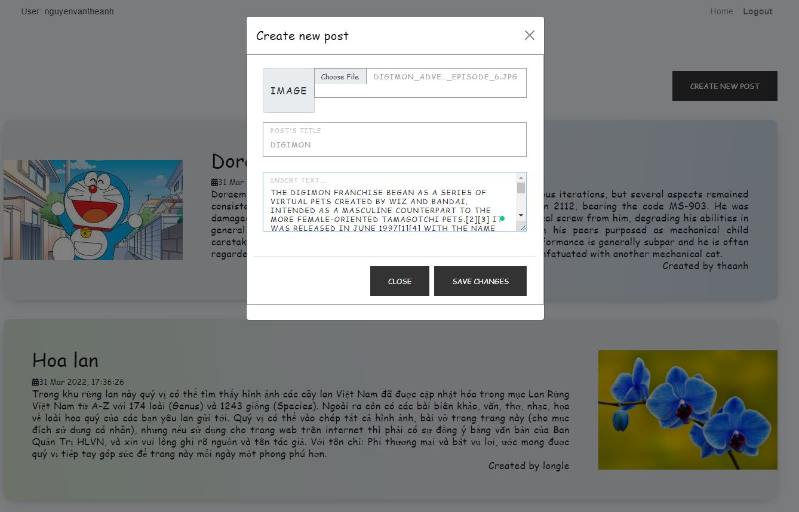

# Homework 3
In this homework, I have done:
# Basic part
Implement blog website features:
```
A public "Story" page where everyone can see all blog posts
```
Only authenticated user can add new post
```
# Preview
1) Public blog




2) Create your account:


3) Logged in blog



4) Create post



5) View new post


