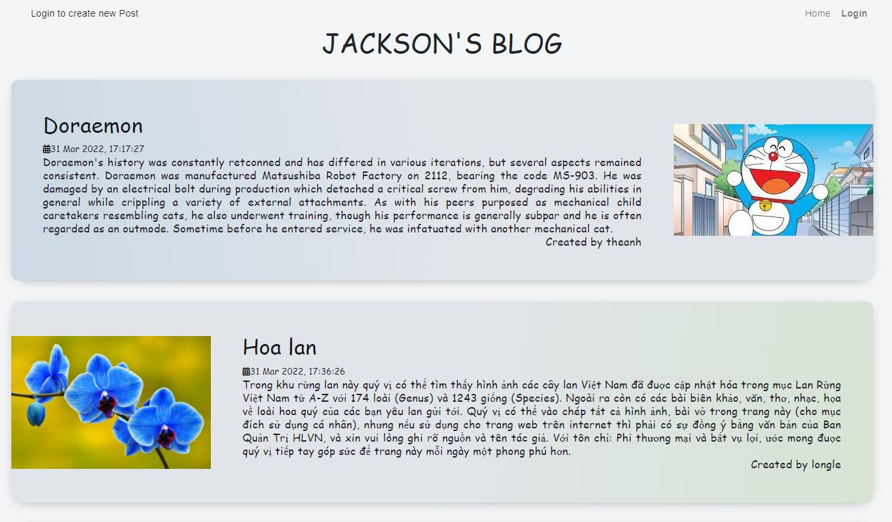
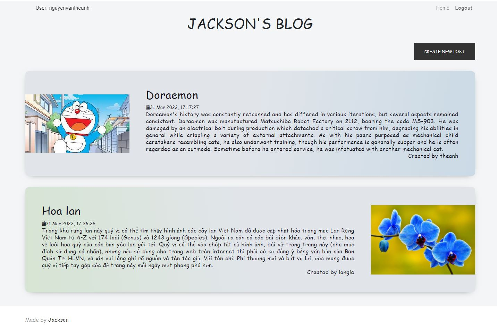
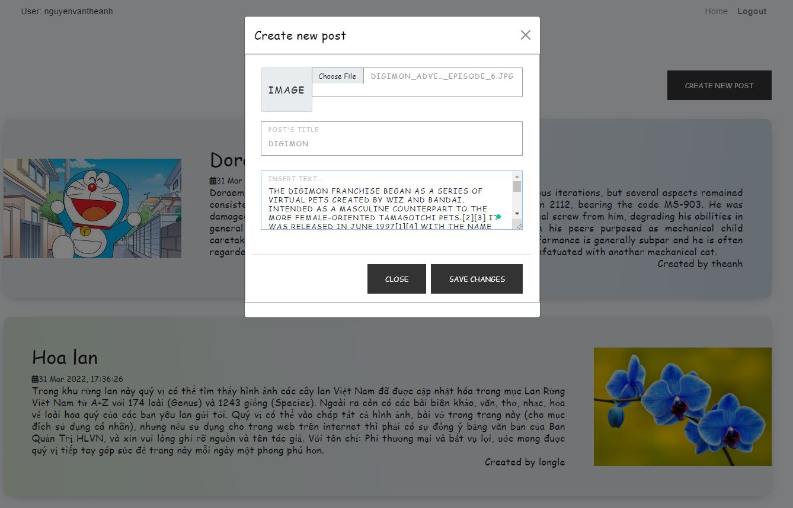

# Homework 3
In this homework, I have done:
# Basic part
Implement blog website features:
1) A public "Story" page where everyone can see all blog posts
2) Only authenticated user can add new post
# Note
- `/login` - Login with your name and your password
- `/logout` - Logout from your account
- `/index` - View the posts
- `/create-post` - Create a new post for logined user

# Step-by-step
 1) Public blog

 2) Create account

 3) Logged in

 4) Create post

 5) View new post

